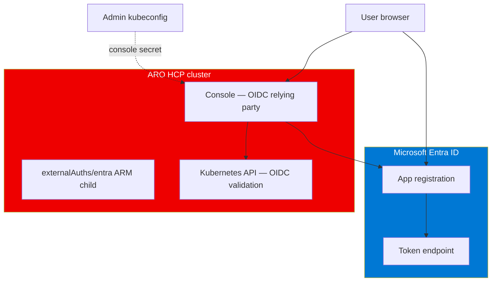

# External Authentication with Microsoft Entra ID

Configure ARO HCP console and CLI OIDC using Microsoft Entra ID. This repository automates the flow with `make cluster.<name>.external-auth` ([`scripts/external-auth.sh`](../../scripts/external-auth.sh)).

**Console is not usable until external-auth completes** — without it, the console URL returns “Application is not available” and ClusterOperator `console` stays degraded.

## Architecture



The script:

1. Creates or updates an Entra app registration (redirect URIs include console `/auth/callback`).
2. Resets a client secret for the confidential console client.
3. Calls `az aro hcp cluster external-auth create` (issuer, audience, username claim, groups claim, console + CLI clients).
4. Applies the console client secret to `openshift-config` using the **24h admin kubeconfig**.

Run `make cluster.<name>.kubeconfig` before `external-auth`.

## Prerequisites by plane

| Plane | Requirement | Notes |
|-------|-------------|-------|
| Azure RBAC | **Contributor** on `hcpOpenShiftClusters` (or customer RG) | PUT `externalAuths` child resource |
| Entra ID | App registration rights — see [Directory roles](#directory-roles-least-privilege) | Separate from Azure subscription Owner |
| OpenShift | Admin **kubeconfig** (from `make cluster.<name>.kubeconfig`) | Applies secret in `openshift-config`; TTL 24h |
| Tools | `az`, `oc`, `jq` | `oc` >= 4.20 with `oc-oidc` for `login` subcommand |

## Directory roles (least privilege)

The script uses Azure CLI Microsoft Graph delegated permissions (`az ad app create`, `az ad sp create`, `az ad app update`, `az ad app credential reset`, optional `az ad app delete`).

**You do not need Global Administrator.** You do **not** always need Application Administrator.

| Tenant setting | What the operator needs |
|----------------|-------------------------|
| Entra ID → Users → User settings → **Users can register applications** = **Yes** (common default) | No directory admin role. Operator creates the app, becomes **owner**, manages secrets and redirect URIs. |
| That setting = **No** (locked-down enterprise) | **Application Developer** — creates apps the operator owns when user registration is disabled. Broader: **Cloud Application Administrator** or **Application Administrator** (tenant-wide app management — treat as privileged). |

[Application Developer](https://learn.microsoft.com/entra/identity/role-based-access-control/permissions-reference#application-developer) is Microsoft’s documented least-privilege role when user app registration is disabled.

[Cloud Application Administrator](https://learn.microsoft.com/entra/identity/role-based-access-control/permissions-reference#cloud-application-administrator) can manage all enterprise apps — more power than this script requires.

### What the default script does **not** require

| Not required | Why |
|--------------|-----|
| Application Administrator | No tenant-wide app management |
| Microsoft Graph **application** permissions on the OIDC app | Uses `preferred_username`, not Graph `email` claim |
| Tenant admin consent for Graph on the cluster app | No `az ad app permission add` / admin consent flow |
| Global Administrator | Directory roles above suffice |

### Azure CLI Graph consent

`az ad *` uses Microsoft Graph as the signed-in user (typically `Application.ReadWrite.All` delegated). First run may prompt consent. If the tenant disables user consent, a **Cloud Application Administrator** (or Global Administrator) must grant admin consent to **Azure CLI** for those Graph scopes — that is consent for the CLI tool, not for the cluster OIDC app.

### Admin-created app (split responsibility)

If an identity admin creates the app:

1. Admin creates app registration and adds the operator as **owner**.
2. Operator sets `CLIENT_ID` in `.external-auth/state.env` or re-runs create (script reuses stored `CLIENT_ID`).
3. Operator still needs owner (or Application Developer) for `az ad app credential reset`.

## Run external-auth

```bash
make cluster.<name>.kubeconfig
make cluster.<name>.external-auth
```

Environment (optional overrides via terraform outputs / tfvars):

| Variable | Default source |
|----------|----------------|
| `EXTERNAL_AUTH_NAME` | `entra` |
| `APP_DISPLAY_NAME` | `<cluster_name>-console` |

State file: `.external-auth/state.env` (gitignored) — stores `CLIENT_ID` for idempotent re-runs.

### Subcommands

| Command | Azure | Entra | OpenShift |
|---------|-------|-------|-----------|
| `create` (default via make) | Contributor on cluster | App + SP + secret | Admin kubeconfig |
| `show` | Reader on cluster | None | None |
| `delete` (via `external-auth-delete`) | Contributor on cluster | Delete app (owner or elevated role) | Optional — delete console secret |
| `rbac-user` | None | `az ad signed-in-user show` | Admin kubeconfig — `ClusterRoleBinding` to `cluster-admin` |
| `rbac-group` | None | Optional `groupMembershipClaims` on app | Admin kubeconfig — `GROUP_ID=` required |
| `login` | None | Token or client secret | OIDC or token login |

Grant OpenShift access to your Entra user:

```bash
bash scripts/external-auth.sh rbac-user
```

Grant to an Entra security group:

```bash
GROUP_ID=<object-id> bash scripts/external-auth.sh rbac-group
```

Looking up group IDs may require **Group Reader** or **Directory Reader** in locked-down tenants.

## First login and user consent

Users authenticating to the console or `oc login --exec-plugin=oc-oidc` may see “Permissions requested” for OpenID / `profile`. If user consent is allowed, they accept individually. If user consent is disabled, an admin consents to **this** app for the tenant (still not Application Administrator if another owner created the app).

## Typical failures

| Error | Cause | Fix |
|-------|-------|-----|
| `Authorization_RequestDenied` on `az ad app create` / `credential reset` | User app registration disabled; no Application Developer | Assign Application Developer or have admin create app + add you as owner |
| `AADSTS65001` | Missing consent | Admin consent for Azure CLI Graph scopes and/or OIDC app |
| Console 503 / “Application is not available” | External-auth not run or secret missing | Re-run `make cluster.<name>.external-auth` after fresh kubeconfig |
| Invalid redirect URI | Console URL changed or wrong callback | Re-run create — script updates redirect URIs from live console URL |
| Secret step skipped | No kubeconfig at external-auth time | `make cluster.<name>.kubeconfig` then re-run external-auth |

## Delete external auth

```bash
make cluster.<name>.external-auth-delete
```

Removes ARM `externalAuths`, console secret (if kubeconfig present), and Entra app (if state file exists). Deleting the Entra app requires app **owner** or directory role with delete rights — subscription Owner is insufficient.

## Related

- [Full-stack — permissions by step](../prerequisites/full-stack.md#permissions-by-deployment-step)
- [Architecture — operator permissions](../architecture.md#operator-permissions)
- [Architecture — credentials and optional Entra](../architecture.md#credentials-and-optional-entra)
