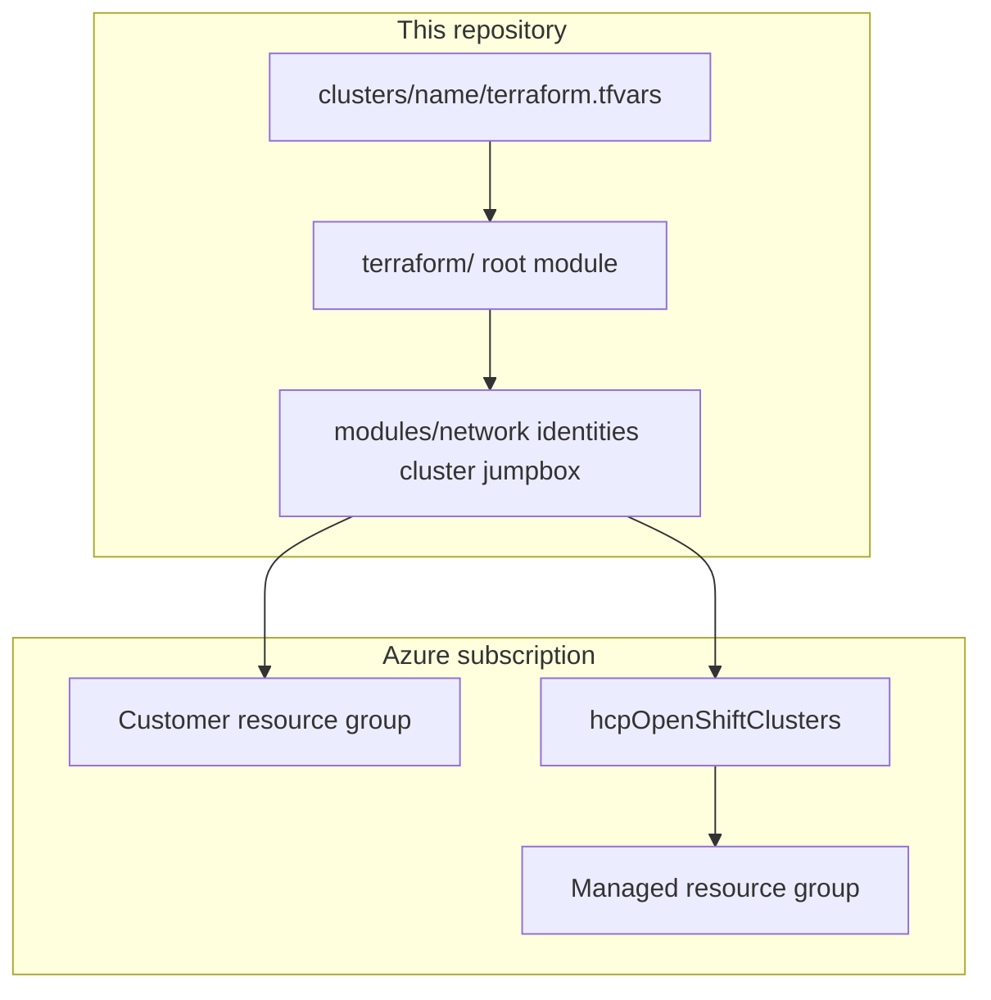

# ARO HCP Reference Deployment

Reference Terraform and scripts for deploying **Azure Red Hat OpenShift Hosted Control Plane (ARO HCP)** on Azure (`2026-06-30-preview` API, [bennerv/ARO-HCP 0.0.2](https://github.com/bennerv/ARO-HCP/releases/tag/0.0.2)).

This repository uses reusable Terraform modules and a **directory-per-cluster** pattern (`clusters/<name>/terraform.tfvars`) for state isolation and lifecycle management.

## Documentation map

| I want to… | Start here |
|------------|------------|
| Deploy my first cluster quickly | [Quick Start](getting-started/quick-start.md) |
| Verify subscription, RBAC, and quota | [Account Prerequisites](prerequisites/account.md) |
| See least-privilege permissions per `make` target | [Full-Stack Deployment — permissions by step](prerequisites/full-stack.md#permissions-by-deployment-step) |
| Configure Entra console OIDC | [External Auth with Entra ID](guides/external-auth-entra-id.md) |
| Inspect Azure resources, RBAC scopes, and diagrams | [Architecture](architecture.md) |
| Choose cluster profiles (public vs private) | [Cluster configurations](../clusters/README.md) |

## Architecture at a glance



## Example cluster profiles

| Profile | Example directory | Typical use |
|---------|-------------------|-------------|
| Public API + ingress | `clusters/public/` | Development, public console |
| Private API + ingress + jump | `clusters/private/` | Private endpoints, sshuttle via jump box |

## Local preview

```bash
pip install -r requirements-docs.txt
make docs-preview
```

Open [http://127.0.0.1:8000/aro-hcp/](http://127.0.0.1:8000/aro-hcp/).

## Documentation styling

The published site uses [Red Hat design system tokens](https://ux.redhat.com/get-started/developers/tokens/) for color, typography, and spacing, aligned with the [Red Hat brand standards](https://www.redhat.com/en/about/brand/standards) interface palette (`#ee0000` brand red, Red Hat Display/Text/Mono). Overrides live in [`docs/stylesheets/redhat-brand.css`](stylesheets/redhat-brand.css).

This is a **community reference** site (MkDocs Material + RHDS tokens), not a `*.redhat.com` product documentation property. Hybrid-style marketing artwork and official Red Hat logo usage are out of scope.

## Related

- [GitHub repository](https://github.com/rh-mobb/aro-hcp)
- [bennerv/ARO-HCP CLI guide](https://github.com/bennerv/ARO-HCP/releases/tag/0.0.2)
